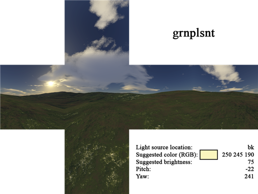
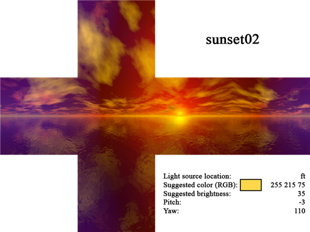

# 2D Skybox Reference

This is an archived reference of MS:R's unique 2D skybox textures, written originally by J-M v2.5.5. Image organization also originally credit to J-M v2.5.5.

You may find that brightness values need to be adjusted slightly with modern VHLT compilers, but color values should hold up well.

## 2D Skybox Orientation

!!! quote "J-M v2.5.5"

First, some information about skyboxes. Hammer has a strange orientation system, as you may have noticed. In the top (x/y) view, the right side of the screen is 0°, the top of the screen is 90°, the left side of the screen is 180°, and the bottom of the screen is 270°. The following two pictures should make clear how every skybox wraps around a map:

Every new point-based entity you create will be oriented in the direction marked by the orange arrow, which is 0°.

This picture illustrates how the six skybox images (bk, dn, ft, lf, rt, up) connect with each other.

## Unique 2D Skybox Reference

