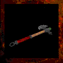

# **Axe**

!!! quote "In-Game Description says:"
    "A wood-cutter's axe."

!!! info inline end ""

    

    
**Axe**

    
Stats

    | Base Skill | Axes |
    | :---------- | :---------- |
    | Level to Wield | 6 |
    | Damage Type | Slash |
    | Base Damage | 150 |
    | 1st Charge | Strong Hit |

The simply named Axe is an early tier one-handed axe that deals decent damage.