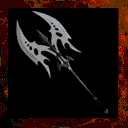

# **Axe of Balance**

!!! quote "In-Game Description says:"
    "This ornate axe is forged to favor accuracy over damage."

!!! info inline end ""

    

    
**Axe of Balance**

    
Stats

    | Base Skill | Axes |
    | :---------- | :---------- |
    | Level to Wield | 18 |
    | Damage Type | Slash |
    | Base Damage | 375 |
    | 1st Charge | Strong Hit |
    | 2nd Charge | Leap |

While two-handed axes typically have low accuracy to favor high damage, however this axe has almost double the accuracy, but nearly half of the amount of damage per swing of similar level axes. This may be useful for leveling as axes around this level typically get very inaccurate. This weapon is also a component in crafting the [Skull Scythe.](skullscythe.md)