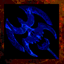

# **Axe of Chaos**

!!! quote "In-Game Description says:"
    "Elemental chaos, in weapon form."

!!! info inline end ""

    

    
**Axe of Chaos**

    
Stats

    | Base Skill | Axes |
    | :---------- | :---------- |
    | Level to Wield | 25 |
    | Damage Type | Slash, Acid, Fire, Cold, Poison, Dark, Lightning, Holy |
    | Base Damage | 500 |
    | 1st Charge | Strong Hit |
    | 2nd Charge | Leap |
    | Alt Ability | Elemental Chaos |
    | Other Abilities | Choose DoT |

The Axe of Chaos is a late game Axe Handling weapon that randomly changes its main damage type while it's being held. The weapon will always try to select an element that your current target is not immune to. The element selected is random and the chance does not change with your target's elemental resistance. The alt ability costs 100 mana and sprays the current element around the player, pushing and afflicting enemies.

## **Abilities**

### **Elemental Chaos**

The current selected element sprays around the player, pushing and afflicting enemies with the appropriate DoT. The force of the push scales based off of the player's max hp; the higher it is, the harder it pushes.

### **Choose DoT**

The weapon, while being held, will randomly change its damage type to either Acid, Fire, Cold, Poison, Dark, Lightning, or Holy, and apply their appropriate DoT when attacking. If you have struck an enemy, the axe will attempt to select an element that the enemy is not immune to. The selection has no weight though and even if the enemy has a tough resistance to something, the element can still be selected if they can at least be damaged.

#### **DoT**

- Duration: 5 seconds (14% chance to be 10 seconds instead)

- Damage: Spellcasting element level * a random number from 0.25, 0.5, 0.75, 1.0, or 2.0.

## **Locations**

- [Undercliffs](../../Regions/undercliffs.md) prismatic chest.