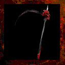

# **Skull Scythe**

!!! quote "In-Game Description says:"
    "A scythe imbued with magics of destruction."

!!! info inline end ""

    

    
**Skull Scythe**

    
Stats

    | Base Skill | Axes |
    | :---------- | :---------- |
    | Level to Wield | 30 |
    | Damage Type | Dark |
    | Base Damage | 500 |
    | 1st Charge | Strong Hit |
    | 2nd Charge | Leap |
    | Alt Ability | Throw |
    | Other Abilities | Vampirism |

The Skull Scythe is a high tier, two-handed axe that leeches life from enemies it inflicts damage to. It has high accuracy and high damage, which is unusual for a two-handed axe to have paired together. The axe may also be thrown at Axe Handling level 34, at the cost of 30 mana. It is also one of several items that is only obtainable through crafting.

## **Abilities**

### **Throw**

Requires 34 Axe Handling and costs 30 mana. Throws the scythe in a straight line in front of the player. Every 1/5th of a second, if enemies are present within the spinning axe, they will be damaged for 3 * Spell Casting Affliction level. If the projectile is active for 10 seconds or hits terrain, or if the player puts the weapon away or drops it, the scythe teleports back to the player. If the player attempts to throw the axe while it is already being thrown, it will return to the player then throw itself again. The thrown weapon will also vampire health from enemies.

### **Vampirism**

If the enemy hit is not undead or otherwise immune to vampire effects, the player heals for 2% of the amount of damage the dealt.

## **Obtaining**

Can only be crafted.

- x2 Dark Tomahawk

- x2 Axe of Balance

- x2 Torkalath Blade

- 100.000 Gold
