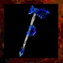

# **Wintercleaver**

!!! quote "In-Game Description says:"
    "A gigantic axe of elemental ice."

!!! info inline end ""

    

    
**Wintercleaver**

    
Stats

    | Base Skill | Axes |
    | :---------- | :---------- |
    | Level to Wield | 30  |
    | Damage Type | Cold |
    | Base Damage | 600 |
    | 1st Charge | Strong Hit |
    | 2nd Charge | Leap |
    | Alt Ability | Freezing Burst |
    | Other Abilities | DoT, Freeze |

The Wintercleaver is a high tier, two-handed axe. It deals Cold damage with all of its abilities, and does a high amount of damage per swing. The axe has the ability to freeze enemies and will apply a Cold DoT on enemies that are struck. This weapon can only be obtained through crafting.

## **Abilities**

### **Damage over Time**

- 100% chance to apply on hit

- Element: Cold

- Damage: Spell Casting Ice level

- Duration: 5 seconds

### **Freezing Burst**

Requires 25 Spell Casting Ice and costs 50 mana. A freezing burst emits from the player and any enemies that have less than 2000 health are frozen within a short radius.

### **Freeze**

Striking the same target four times in succession will cause them to freeze, but only if their current health is below 2000.

## **Obtaining**

Can only be crafted.

- x2 Ice Tomahawk

- x2 Torkalath Blade

- 50.000 Gold
