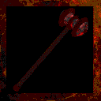

# **Demon Bludgeon Hammer**

!!! quote "In-Game Description says:"
    "A massive Bludgeon Demon hammer powered by an infernal soul."

!!! info inline end ""

    

    
**Demon Bludgeon Hammer**

    
Stats

    | Base Skill | Blunt Arms |
    | :---------- | :---------- |
    | Level to Wield | 30  |
    | Damage Type | Dark |
    | Base Damage | 450 |
    | 1st Charge | Strong Hit |
    | 2nd Charge | Stun/Fire Wave |
    | Alt Ability | Bludgeon Rage |

The Demon Bludgeon Hammer is a direct upgrade from the Bludgeon Hammer, dealing more damage, doing dark instead of blunt, and applies a fire DOT. The Demon Bludgeon Hammer also has more charges for Bludgeon Rage.

## **Abilities**

### **Stun/Fire Wave**

A little known aspect about the Demon Bludgeon Hammer is that it can perform a fire wave, just like Infernal Claws. It costs 40 mana to perform and requires a Spell Casting fire level of 25. To use the Fire Wave, charge the hammer to red, and strike the ground. The Fire will spread in a cone in front of you and will apply a fire DOT to those within the vicinity.

### **Bludgeon Rage**

The Demon Bludgeon Hammer has 6 charges for Bludgeon Rage per map. Using it will buff your damage and vampire health off of enemies upon being struck. The Bludgeon Rage lasts 40 seconds, assuming you don't put the Demon Bludgeon Hammer away.

## **Obtaining**

Can only be crafted.

- x1 Bludgeon Hammer

- x2 Fire Tomahawk

- x2 Dark Tomahawk

- x2 Torkalath Blade

- 25.000 Gold