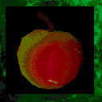

# **Apple**

!!! quote "In-Game Description says:"
    "An apple."

!!! info inline end ""

    

    
**Apple**

    
Stats

    | Base Skill | N/A |
    | :---------- | :---------- |
    | Effect | Heals 1 health point |
    | Bites | 4 |

While the apple is not useful itself, there is two places where it can be used. In Edana, it can be used to bribe the Mayor's Guard instead of 500 gold. He will accept and reply with "A delicious treat, proceed traveler."

In Helena, an apple can be offered to Torwhodoc Sa'thraz after proposing that he could eat one instead of you coughing up 1000 gold to open the portal to old_helena.

Humorously, you can give a half-eaten apple to both of them and they will still accept it.

## **Locations**

- Sold by food merchants in towns.

- General Loot
    - Low level pool