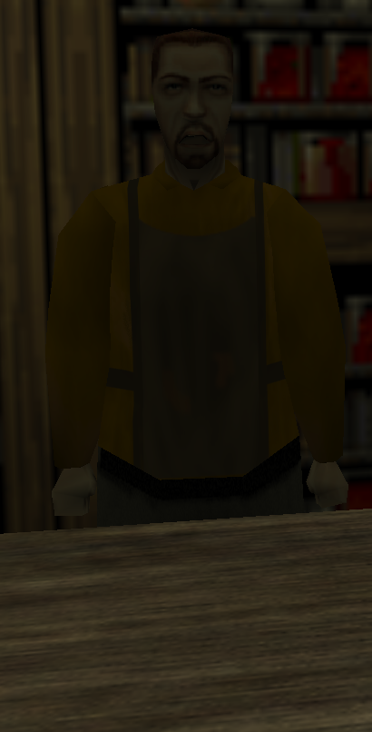

# **Foglund the Merchant**

!!! info inline end ""

    

    
**Foglund the Merchant**

    
Stats

    | Attribute | Info |
    | :---------- | :---------- |
    | Disposition | Friendly |
    | Health | 25 |

A poor soul, whom most players meet in the town of Edana. He sells all the tools for beginning adventurers, and ventures out himself. A taxidermist, he consistently hunts animals, primarily bears. He also starts the Curse of the Bear Gods quest, starting in lowlands.

## **Regions**

- [Edana](../../Regions/Edana.md)
	- Market square (outside)
