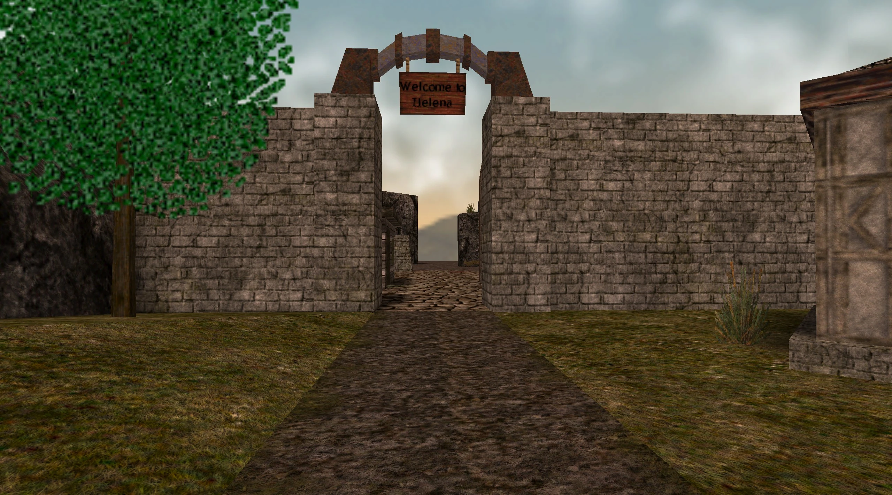

# **Old Helena**

!!! quote "Map Description"
    "XXX"

!!! info inline end ""

    

    
**Old Helena Entry**

## **Overview**

Old Helena is a glimpse of the town of Helena stuck in a point in time where peace was a luxury rarely enjoyed. Biding their time, the few remaining citizens of this battered town still continue to try to eek out a living, hoping to one day rebuild the walls of their home. Unfortunately the horn of war sounds on the horizon once again, and they must call upon capable fighters to help them make it through the day.

## Trivia

- To reach this map conventionally, you must locate the time wizard Torwhodoc in the present day town of Helena, and pay him the fee required (1,000 gold) to cast the spell and open the portal.

- This is map was inspired by the original WON (Pre-Steam) Helena release.