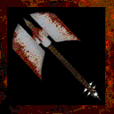

# Blood Axe

!!! quote "In-Game Description says:"
    "A sinister breed of axe forged with the blood of vampires and demons."

!!! info inline end ""

    

    
**Blood Axe**

    
Stats

    | Base Skill | Axes |
    | :---------- | :---------- |
    | Level to Wield | 15 |
    | Damage Type | Slash |
    | Base Damage | 500 |
    | 1st Charge | Strong Hit |
    | 2nd Charge | Vampirism |

The Blood Axe is a mid Tier, two-handed Axe Handling weapon. The weapon is slow and relatively inaccurate, but makes up for it in with its damage and vampire ability.

## Abilities

### Vampirism

The Blood Axe is a mid Tier, two-handed Axe Handling weapon. The weapon is slow and relatively inaccurate, but makes up for it in with its damage and vampire ability.

## Obtaining

    * Demontemple after last boss if there are 7 players with at least 20 max health on the server that are not flagged as AFK at the time of opening the chest.
    * Random the_wall reward.